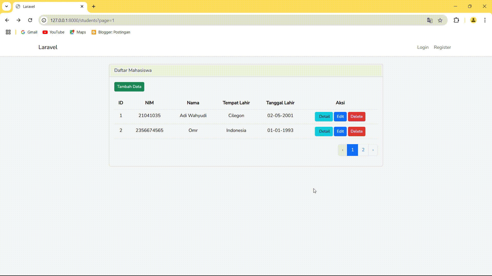
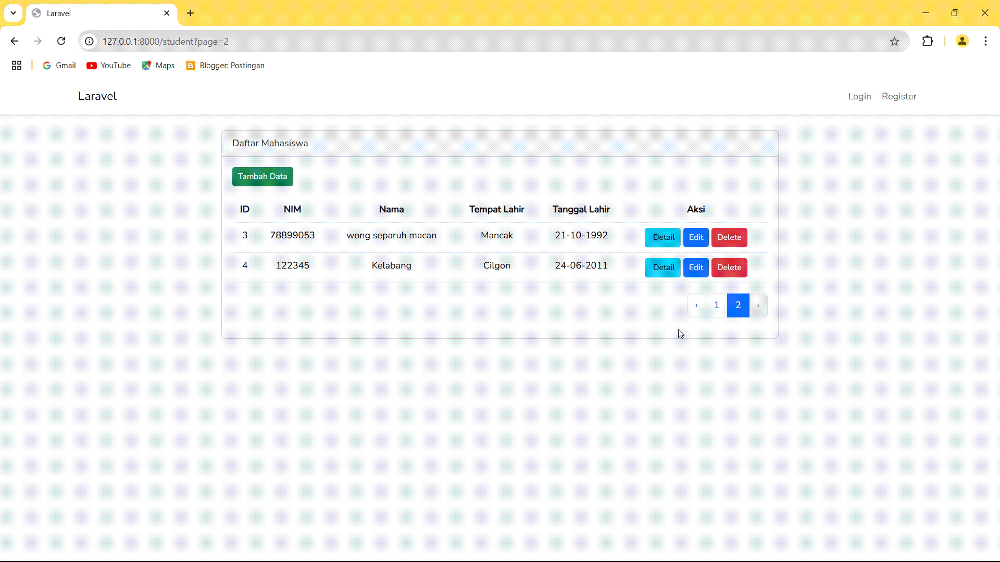
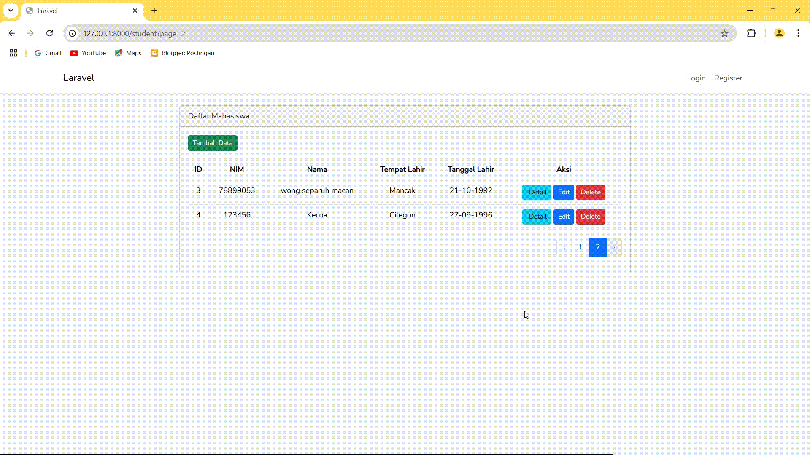

# UTS-WEB3
Adi Wahyudi(21041035)
UNIVAL
Smt7 FIK A

# Soal 
Buatlah Aplikasi Untuk Management data Mahasiswa dengan menggunakan Laravel seperti gambar di bawah ini, Fitur Create Read Update Delete dan Pagination wajib.
.png)

# Tambah Data

# Edit Data

# Hapus Data

